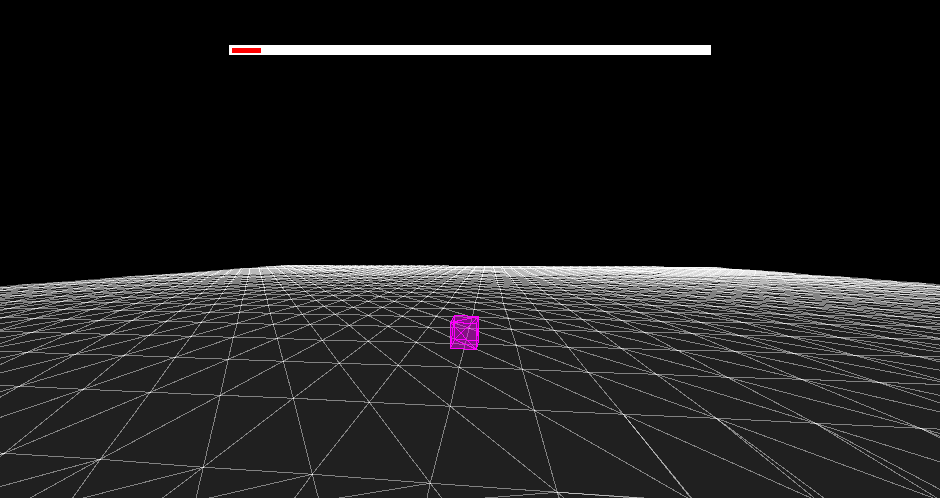

# 🎲 Swing3D

Swing3D is a fun project I developed to render 3D graphics using Swing and its primitive drawing methods.

Please note that this "rendering engine" is neither fast nor complete. This project was primarily meant to be an educational journey to learn about the math involved in rendering 3D graphics on a 2D screen.

If you only care about the actual math and how I applied it to get this working, have a look at [the RenderingPipeline](src/util/RenderingPipeline.java).

The few comments that have been added to the code are primarily written in German, as I was using this project to teach a friend of mine the basics of 3D rendering.

---

---

# Looking for something?

Here you can find the most interesting sections of this project:

- Initialization: [PSVM](./src/Main.java), [UserInterface](./src/gui/UserInterface.java)
- 3D objects and paths: [Objects](./src/world/objects), [Paths](./src/world/pathmanagers)
- Primary rendering pipeline: [RenderingPipeline](./src/util/RenderingPipeline.java)
- **Very** basic clipping: [ClippingUtility](./src/util/ClippingUtility.java)

# Want to contribute?

I personally do not have much time to work on this project. If you're interested in contributing, I highly encourage you to open an issue and start coding! Any contribution is welcome.